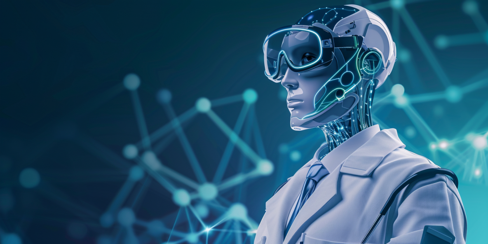

# AI for Healthcare: An Innovative Perspective

AI in healthcare represents a transformative force, poised to redefine traditional paradigms and introduce new levels of efficiency and personalization in patient care. This essay explores the potential applications of generative AI, vision computing, and multimodal models in revolutionizing healthcare delivery.

### Enhanced Personalization and Efficiency

The integration of AI technologies in healthcare settings promises more tailored and efficient patient care. By leveraging generative AI, healthcare providers can create customized treatment plans that adapt to individual patient needs, improving outcomes and patient satisfaction. Vision computing aids in the accurate analysis of medical images, such as X-rays and MRIs, enhancing diagnostic precision beyond human capabilities.

### Streamlined Administrative Processes

AI's ability to automate and optimize administrative tasks can significantly reduce the workload on healthcare professionals, allowing them to focus more on patient care. This includes everything from patient scheduling to the management of medical records, all streamlined by AI systems.

## Diverse Perspectives on AI in Healthcare

### From a Doctor's Viewpoint

For doctors, the healthcare landscape is vast and intricate, filled with an overwhelming amount of data from patient records to complex medical imaging. AI tools can dissect and interpret this data efficiently, aiding doctors in making informed decisions swiftly, thus enhancing the quality of care provided.

### From a Patient's Perspective

Patients, particularly those grappling with undiagnosed symptoms, seek clarity and prompt answers about their health conditions. Generative AI can offer preliminary diagnoses based on symptoms, suggest potential specialists, and guide patients through the necessary steps for treatment, always emphasizing the importance of professional medical consultation.

## Potential Use Cases of AI in Healthcare

1. **Screening and Diagnosis**: AI can serve as a virtual medical assistant, scheduling appointments and even suggesting initial diagnoses based on patient-reported symptoms. This accelerates the process of finding the appropriate specialist and treatment, making healthcare more accessible and efficient.

2. **Vision Computing in Medical Imaging**: Advanced algorithms can analyze medical images with greater accuracy than ever before, identifying subtle patterns that may be missed by the human eye. This capability is crucial for early detection of diseases such as cancer, where early intervention can dramatically improve prognosis.
  

4. **Multimodal Models for Comprehensive Care**: These models integrate multiple types of data (text, images, and audio) to provide a holistic view of a patient's health. This comprehensive approach supports more accurate diagnoses and better patient management. 

In conclusion, the potential of generative AI, vision computing, and multimodal models in healthcare is immense. These technologies not only promise to enhance the efficiency and accuracy of medical services but also offer a more personalized healthcare journey for patients, ultimately leading to improved health outcomes.
